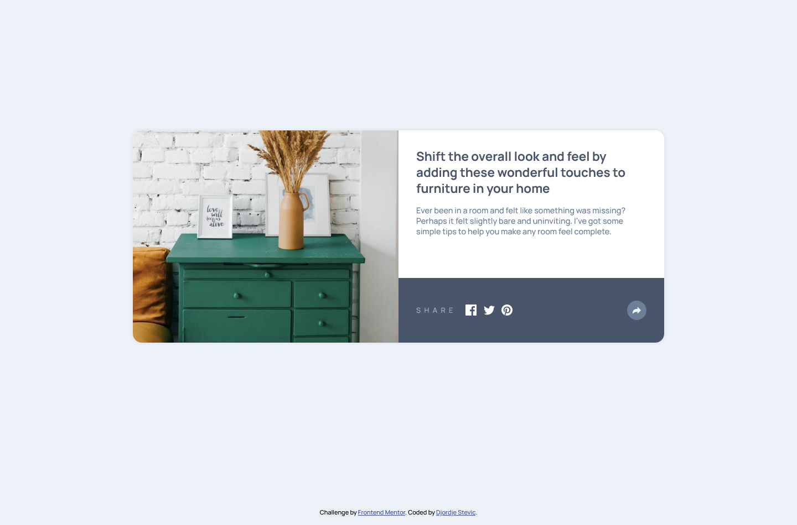

# Frontend Mentor - Article preview component solution

This is a solution to the [Article preview component challenge on Frontend Mentor](https://www.frontendmentor.io/challenges/article-preview-component-dYBN_pYFT). Frontend Mentor challenges help you improve your coding skills by building realistic projects.

## Table of contents

- [Overview](#overview)
  - [The challenge](#the-challenge)
  - [Screenshot](#screenshot)
  - [Links](#links)
- [My process](#my-process)
  - [Built with](#built-with)
  - [What I learned](#what-i-learned)
  - [Continued development](#continued-development)
  - [Useful resources](#useful-resources)
- [Author](#author)

## Overview

### The challenge

Users should be able to:

- View the optimal layout for the component depending on their device's screen size
- See the social media share links when they click the share icon

### Screenshot

### Links

- Solution URL: [https://www.frontendmentor.io/solutions/flexbox-mobile-grid-desktop-layout-UDRWz4gif](https://www.frontendmentor.io/solutions/flexbox-mobile-grid-desktop-layout-UDRWz4gif)
- Live Site URL: [https://djokaras.github.io/article-preview-component/](https://djokaras.github.io/article-preview-component/)

## My process

I've started with mobile first approach. Mobile layout using flex, for desktop version I've used grid by spaning img element.

### Built with

- Semantic HTML5 markup
- CSS custom properties
- Flexbox
- CSS Grid
- Mobile-first workflow

### What I learned

Similar challenge like previous ones. Practices layout for both mobile and desktop. I've reminded myself of grid and spanning.

### Continued development

Must practice more semantic HTML. Also I don't feel comfortable using grid and span in it, so I have to go back to my resources and strengthen that area.

### Useful resources

- [For practicing grid](https://css-tricks.com/snippets/css/complete-guide-grid/) - This helped me with grid span, and I should revisit it.

## Author

- Website - [Djordje Stevic](https://github.com/Djokaras)
- Frontend Mentor - [@Djokaras](https://www.frontendmentor.io/profile/Djokaras)
